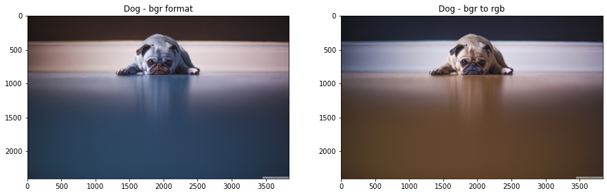
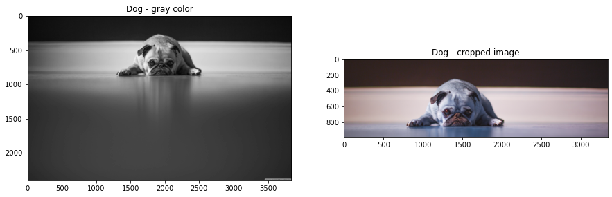
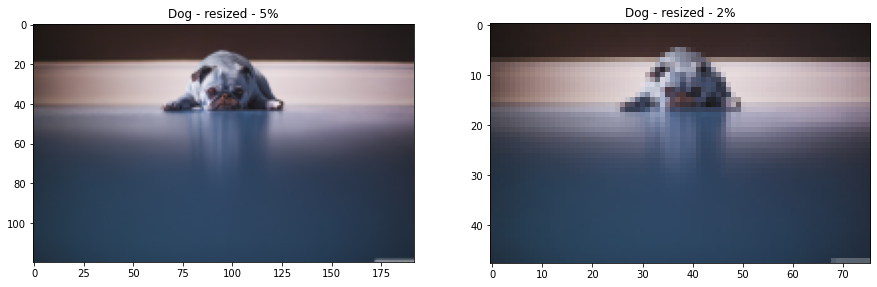
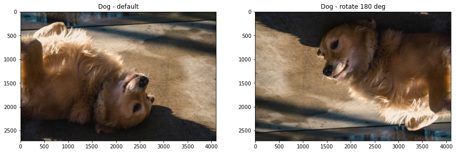
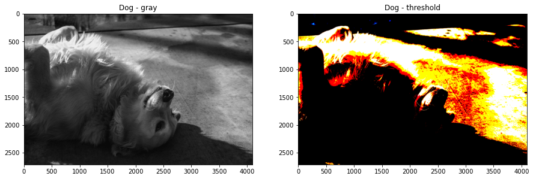
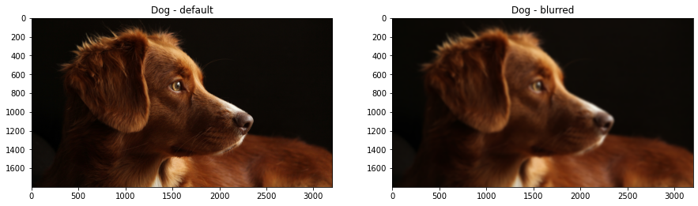
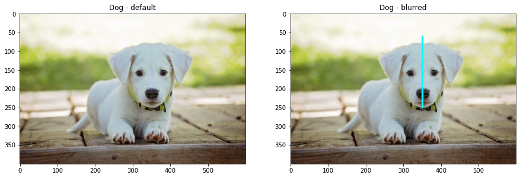
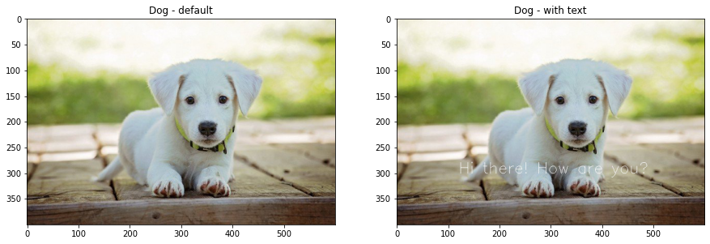
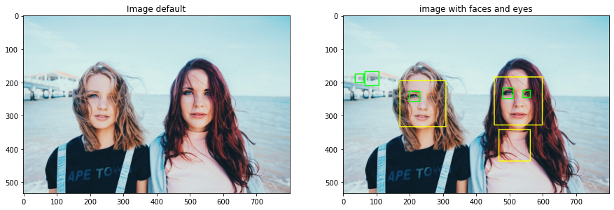

```python
import cv2
from matplotlib import pyplot as plt

print(cv2.__version__)
```

    4.0.1

```python
image = cv2.imread('img/dog.jpg')
```


```python
f = plt.figure(figsize=(15,15))
f.add_subplot(1,2,1)
plt.imshow(image)
plt.title('Dog - bgr format')

f.add_subplot(1,2,2)
rgb_image = cv2.cvtColor(image, cv2.COLOR_BGR2RGB)
plt.imshow(rgb_image)
plt.title('Dog - bgr to rgb')
```


    Text(0.5, 1.0, 'Dog - bgr to rgb')





```python
f = plt.figure(figsize=(15,15))

f.add_subplot(1,2,1)
gray = cv2.cvtColor(image, cv2.COLOR_BGR2GRAY)
plt.imshow(gray, cmap = 'gray')
plt.title('Dog - gray color')

f.add_subplot(1,2,2)
cropped = image[10:1000, 500:4000]
plt.imshow(cropped)
plt.title('Dog - cropped image')
```


    Text(0.5, 1.0, 'Dog - cropped image')





```python
f = plt.figure(figsize=(15,15))

# -------------------------------------
f.add_subplot(1,2,1)
scale_percent = 5

width = int(image.shape[1] * scale_percent / 100)
height = int(image.shape[0] * scale_percent / 100)

dim = (width, height)
resized = cv2.resize(image, dim, interpolation = cv2.INTER_AREA)

plt.imshow(resized)
plt.title('Dog - resized - 5%')

# -------------------------------------
f.add_subplot(1,2,2)

scale_percent = 2

width = int(image.shape[1] * scale_percent / 100)
height = int(image.shape[0] * scale_percent / 100)

dim = (width, height)
resized = cv2.resize(image, dim, interpolation = cv2.INTER_AREA)

plt.imshow(resized)
plt.title('Dog - resized - 2%')
```


    Text(0.5, 1.0, 'Dog - resized - 2%')





```python
image = cv2.imread('img/dog_2.jpg')
image = cv2.cvtColor(image, cv2.COLOR_BGR2RGB)
```


```python
f = plt.figure(figsize=(15,15))

# -------------------------------------
f.add_subplot(1,2,1)
plt.imshow(image)
plt.title('Dog - default')

# -------------------------------------
f.add_subplot(1,2,2)
(h, w, d) = image.shape
center = (w // 2, h // 2)
M = cv2.getRotationMatrix2D(center, 180, 1.0)
rotated = cv2.warpAffine(image, M, (w, h))

plt.imshow(rotated)
plt.title('Dog - rotate 180 deg')
```


    Text(0.5, 1.0, 'Dog - rotate 180 deg')





```python
f = plt.figure(figsize=(15,15))

# -------------------------------------
f.add_subplot(1,2,1)
gray_image = cv2.cvtColor(image, cv2.COLOR_BGR2GRAY)
plt.imshow(gray_image, cmap="gray")
plt.title('Dog - gray')

# -------------------------------------
f.add_subplot(1,2,2)
ret, threshold_image = cv2.threshold(image, 127, 255, 0)
plt.imshow(threshold_image)
plt.title('Dog - threshold')
```


    Text(0.5, 1.0, 'Dog - threshold')





```python
image = cv2.imread('img/dog_3.jpg')
image = cv2.cvtColor(image, cv2.COLOR_BGR2RGB)

f = plt.figure(figsize=(15,15))

# -------------------------------------
f.add_subplot(1,2,1)
plt.imshow(image)
plt.title('Dog - default')

# -------------------------------------
f.add_subplot(1,2,2)
blurred = cv2.GaussianBlur(image, (61, 61), 0)
plt.imshow(blurred)
plt.title('Dog - blurred')
```


    Text(0.5, 1.0, 'Dog - blurred')





```python
image = cv2.imread('img/dog_4.jpeg')
image = cv2.cvtColor(image, cv2.COLOR_BGR2RGB)

f = plt.figure(figsize=(15,15))

# -------------------------------------
f.add_subplot(1,2,1)
plt.imshow(image)
plt.title('Dog - default')

# -------------------------------------
f.add_subplot(1,2,2)

output = image.copy()
cv2.rectangle(output, (250, 60), (450, 250), (0, 255, 255), 3)

plt.imshow(output)
plt.title('Dog - with rectangle')
```


    Text(0.5, 1.0, 'Dog - with rectangle')


```python
image = cv2.imread('img/dog_4.jpeg')
image = cv2.cvtColor(image, cv2.COLOR_BGR2RGB)

f = plt.figure(figsize=(15,15))

# -------------------------------------
f.add_subplot(1,2,1)
plt.imshow(image)
plt.title('Dog - default')

# -------------------------------------
f.add_subplot(1,2,2)

output = image.copy()
cv2.line(output, (350, 60), (350, 250), (0, 255, 255), 3)

plt.imshow(output)
plt.title('Dog - with line')
```


    Text(0.5, 1.0, 'Dog - blurred')





```python
image = cv2.imread('img/dog_4.jpeg')
image = cv2.cvtColor(image, cv2.COLOR_BGR2RGB)

f = plt.figure(figsize=(15,15))

# -------------------------------------
f.add_subplot(1,2,1)
plt.imshow(image)
plt.title('Dog - default')

# -------------------------------------
f.add_subplot(1,2,2)

output = image.copy()
cv2.putText(output, 'Hi there! How are you?', (120, 300),cv2.FONT_HERSHEY_SIMPLEX, 1, (255,255,255), 1)

plt.imshow(output)
plt.title('Dog - with text')

```


    Text(0.5, 1.0, 'Dog - with text')





```python
image = cv2.imread('img/people.jpeg')
gray_image = cv2.cvtColor(image, cv2.COLOR_BGR2GRAY)
image = cv2.cvtColor(image, cv2.COLOR_BGR2RGB)

f = plt.figure(figsize=(15,15))

# -------------------------------------
f.add_subplot(1,2,1)

plt.imshow(image)
plt.title('Image default')

# -------------------------------------
f.add_subplot(1,2,2)

# Search faces
face_cascade = cv2.CascadeClassifier('haarcascade_frontalface_default.xml')
faces = face_cascade.detectMultiScale(gray_image, scaleFactor= 1.1, minNeighbors= 5, minSize=(10, 10))
faces_detected = "Faces count: " + format(len(faces))
print(faces_detected)

# Search eyes
eye_cascade = cv2.CascadeClassifier('haarcascade_eye.xml')
eyes = eye_cascade.detectMultiScale(gray_image)
eyes_detected = "Eyes count: " + format(len(eyes))
print(eyes_detected)

# Show faces
for (x, y, w, h) in faces:
    cv2.rectangle(image, (x, y), (x+w, y+h), (255, 255, 0), 2)

# Show eyes
for (x, y, w, h) in eyes:
    cv2.rectangle(image, (x, y), (x+w, y+h), (0, 255, 0), 2)

    
plt.imshow(image)
plt.title('image with faces and eyes')
```

    Faces count: 3
    Eyes count: 5

    Text(0.5, 1.0, 'image with faces and eyes')



